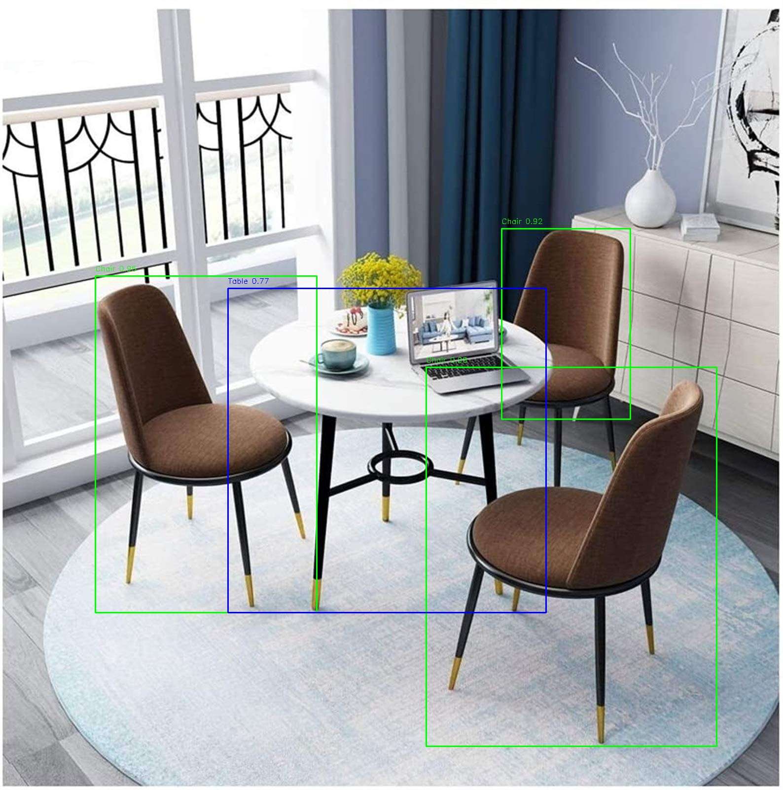

# Furniture_detection

### Introduction
This is a furniture detction model trained on pytorch resnet50 model with synthetic dataset generated in Unreal engine and annoatated with coco-annotator.

---
### How to train the model?
To train the model, first clone the page in your terminal, then go to furniture detction:
```shell
git clone https://github.com/sina2104/Furniture_detection)
cd Furniture_detection
```
Then in the same directory download the dataset from [here](https://disk.yandex.ru/d/lCrNpgwHiHQhUQ).
Now check if you have all the python laboratories use and to train your model:
```shell
python furniture_detection.py
```
In the same dataset you can directly download the already trained model to this directory.

---
### How to run it?
To run the model just write the path to your image like this:
```shell
python run_detection.py /path/to/image.jpg
```
The result with annotaions will appear in the Test_images folder:
```shell
Test_images/Result.jpg
```
### Example

